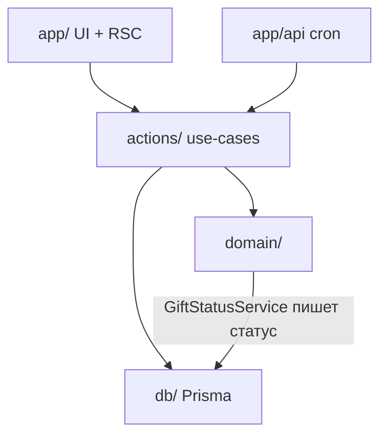
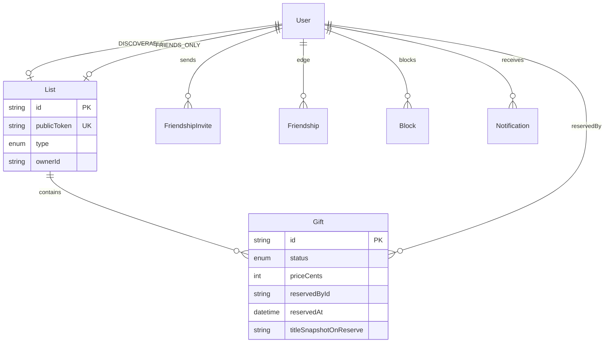
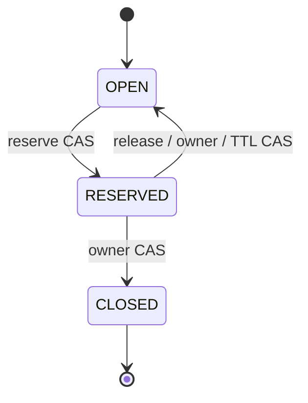

# Architecture Spine — Gift List (Раунд 1)

## Design Paradigm

**Modular monolith · layered Next.js App Router.** Один деплойный юнит; правила домена не живут в React и не дублируются в двух API.

| Слой | Каталог | Может зависеть от |
|------|---------|-------------------|
| UI / routes | `src/app/` | actions, components |
| Application | `src/actions/`, `src/lib/auth/` | domain, db |
| Domain | `src/domain/` | ничего внешнего (чистые правила + порты ошибок) |
| Persistence | `src/db/` | Prisma client only |



Зависимости только **вниз**. Клиент не импортирует Prisma и не обходит `VisibilityPolicy` / `GiftStatusService`.

## Invariants & Rules

### AD-1 — Слои и направление зависимостей

- **Binds:** all
- **Prevents:** бизнес-логика в UI; параллельный SQL из компонентов/cron в обход сервисов
- **Rule:** Мутации продукта — Server Actions; cron/будущие webhooks — Route Handlers, которые **вызывают те же domain/application методы**. Domain не импортирует React/Next. Prisma — из `db/` и application/domain-writer сервисов по AD-8.

### AD-2 — Starter и UI-стек `[ADOPTED UX-A1]`

- **Binds:** frontend, design tokens
- **Prevents:** расхождение UI-библиотеки
- **Rule:** Холодный старт: `create-next-app@latest` (App Router, TypeScript, Tailwind, ESLint) → `shadcn@latest init` → brand delta Forest Paper из UX DESIGN.md.

### AD-3 — Аутентификация `[ASSUMPTION]`

- **Binds:** FR-1..FR-3, A-1..A-3
- **Prevents:** два источника сессии; OAuth в R1
- **Rule:** **Better Auth** — email + пароль, database sessions (cookie httpOnly). Сброс пароля и опциональное confirm-письмо — Resend. Ответы login/register/forgot **не** раскрывают, существует ли email (одинаковый UX). OAuth вне R1. Сессия обязательна для подарков и брони.

### AD-4 — Система записи `[ASSUMPTION]`

- **Binds:** all persistent state
- **Prevents:** разрозненные store
- **Rule:** PostgreSQL — единственный SoR. Prisma ORM **7.10.0** + миграции. Prod: managed Postgres (Neon preferred).

### AD-5 — Деплой и окружения `[ASSUMPTION]`

- **Binds:** ops envelope R1
- **Prevents:** разные хосты без явного решения
- **Rule:** Web → Vercel; DB → managed Postgres; email → Resend; секреты — env Vercel. Job TTL брони (A-9, 14 суток) — Vercel Cron → Route Handler → **только** `GiftStatusService.releaseExpired()`. Staging = preview + отдельная DB.

### AD-6 — Списки, токены, профиль (A-25 / A-26) `[ASSUMPTION]`

- **Binds:** D-11, FR-9, FR-27, FR-28, A-25, A-26
- **Prevents:** URL от ника; ротация ссылок; третий список; расхождение профиля и `/l/...`
- **Rule:**
  1. У пользователя **ровно два** списка: `DISCOVERABLE` и `FRIENDS_ONLY`. DB: `UNIQUE(ownerId, type)`. Создаются при регистрации; API создания/удаления списков в R1 **нет**.
  2. Path шаринга = `/l/:publicToken`. `List.publicToken` = opaque CUID2, глобально UNIQUE, **immutable** после insert (без ротации в R1). Смена ника не трогает token.
  3. Профиль = `/u/:nick` отдельно. Для допустимого зрителя Discoverable грузится через тот же `VisibilityPolicy`, что и token-route. Friends-only **не** показывается строкой на профиле не-другу (gate только на `/l/:token`).
  4. Публичная схема URL только `/l/:publicToken` — без query/`listId` альтернатив.

### AD-7 — Модель видимости (единый gate)

- **Binds:** FR-7, FR-8, FR-11, FR-27, D-11, A-11, A-12, A-14, NFR privacy
- **Prevents:** 404 как soft-deny для не-друга; Block-bypass через ссылку; утечка FO; второй read-owner для подарков
- **Rule:** Единственная `VisibilityPolicy.resolve(viewer, list)` → discriminant JSON `access`: `gifts | friends_only_gate | anon_gate | not_found`.

  **Порядок:**
  1. Список/token не найден → `not_found`.
  2. Есть `Block` в любую сторону между viewer и owner → `not_found` (для **обоих** типов списков и для профиля). Не `friends_only_gate` (не подтверждать существование).
  3. Владелец → `gifts`.
  4. Аноним → `anon_gate` (без подарков).
  5. Friends-only + принятая `Friendship` → `gifts`.
  6. Friends-only + auth не-друг → `friends_only_gate`.
  7. Discoverable + auth → `gifts`.

  **DTO gate:**
  - `friends_only_gate`: `owner: { id, nick, displayName }`, `list: { type: "FRIENDS_ONLY" }`, UX copy key. **Запрещено:** `list.title`, gift ids/titles/descriptions/counts/images/prices/reserved*.
  - `anon_gate`: тип списка можно не раскрывать сверх «войдите»; без подарков.
  - `gifts`: gift cards по AD-12.

  **Матрица чтения подарка:**
  | Контекст | Поля |
  |----------|------|
  | `access=gifts` | Полная gift card (AD-12) |
  | Viewer = `reservedById` и `status=RESERVED` (A-14 / FR-25) | **Только reservation card:** `giftId`, `titleSnapshot` (снимок на момент брони), `status`, `listType`, `ownerNick`, CTA снять. Без siblings FO, без browse списка |
  | gate / not_found | Нет gift-полей |
  | Owner своих списков | Полные карточки |

  Любой list/gift read API (включая профиль) вызывает тот же `resolve`; сырой `findMany` по `listId` без policy запрещён. FR-25 — исключение только через reservation-card матрицу выше.

### AD-8 — Статусы подарка; единственный writer

- **Binds:** FR-10, FR-12, FR-17, A-9, A-23, UX-A11
- **Prevents:** dual mutation paths; self-reserve; reopen без решения
- **Rule:** Enum DB: `OPEN | RESERVED | CLOSED`. **Только** `GiftStatusService` выполняет Prisma/SQL, меняющий `status` / `reservedById` / `reservedAt`. Actions и cron — тонкие вызовы сервиса.

  Переходы R1:
  - `OPEN → RESERVED` — даритель ≠ владелец
  - `RESERVED → OPEN` — держатель | владелец | cron TTL
  - `RESERVED → CLOSED` — владелец; `reservedById` **сохраняется** для аудита; FR-25 активные = `status=RESERVED`
  - `CLOSED → *` запрещены `[ASSUMPTION ARCH-A5]`
  - Владелец **не** может `OPEN → RESERVED` на своём подарке → `FORBIDDEN`
  - `COLLECTION` не используется в R1

  Gift CRUD: поля `title`, `description?`, `priceCents?`, `linkUrl?`; перенос между списками только при `OPEN`; удаление `RESERVED` снимает бронь + notify держателя.

### AD-9 — Сериализация всех переходов статуса

- **Binds:** FR-17, FR-19 (R1), SM-2, A-9
- **Prevents:** двойная бронь; гонки release/close/cron; fork схемы брони
- **Rule:** R1 хранит бронь **на `Gift`**: `status`, `reservedById`, `reservedAt`. Таблицы `Reservation` в R1 **нет**.

  Каждый переход — одна транзакция с CAS на ожидаемый статус (+ предикат актора):

  | Transition | Predicate |
  |------------|-----------|
  | OPEN→RESERVED | `status=OPEN`; set reserved* |
  | RESERVED→OPEN (holder) | `status=RESERVED AND reservedById=actor`; clear reserved* |
  | RESERVED→OPEN (owner/cron) | `status=RESERVED` (+ cron: `reservedAt <= now()-14d`); clear reserved* |
  | RESERVED→CLOSED | `status=RESERVED`; set CLOSED; keep `reservedById` |

  `rowCount ≠ 1` → `CONFLICT`. Клиентский optimistic UI не авторитетен.

### AD-10 — Дружба `[ADOPTED D-10]`

- **Binds:** FR-13..FR-15, FR-23, FR-24, A-11, A-12, A-16
- **Prevents:** invite как источник FO; дубли рёбер; Block в обход policy
- **Rule:**
  1. FO ↔ существует строка `Friendship` (не статус инвайта).
  2. Pending = `FriendshipInvite` (направленный). Accept = одна транзакция: insert `Friendship(userLowId,userHighId)` UNIQUE, удалить **все** инвайты между парой. Если встречный pending при создании инвайта — **auto-accept** тем же протоколом.
  3. Reject/cancel удаляет инвайт. Повтор после reject — не раньше 24ч (A-16).
  4. Unfriend: delete Friendship + инвайты пары. Block: то же + insert `Block`; новые инвайты запрещены; видимость — AD-7 шаг 2.

### AD-11 — Шов Раунда 2 без реализации

- **Binds:** A-24, A-17..A-21, FR-4, FR-16, FR-18..22
- **Prevents:** ledger в R1 **или** модель, ломающая платежи
- **Rule:** Нет таблиц платежей / ЮKassa / Contribution в R1. `priceCents` nullable. R2 добавит таблицы + `COLLECTION` + взаимоисключение внутри `GiftStatusService` без смены AD-6/7/10. FR-4 email-gate на деньги — R2. Заглушки оплаты в UI запрещены.

### AD-12 — Wire-контракт мутаций и карточек

- **Binds:** all write/read DTOs, A-23, UJ-2
- **Prevents:** разнобой shapes; FO gate как NOT_FOUND; скрытое имя брони
- **Rule:** Action result: `{ ok: true, data } | { ok: false, code, message }`. Коды **закрытый** набор: `UNAUTHENTICATED | FORBIDDEN | NOT_FOUND | CONFLICT | VALIDATION | RATE_LIMITED`. Gate-ответы — `ok: true` с `access`.

  Gift card при `access=gifts`:
  `{ id, title, description, priceCents: number|null, linkUrl, status: "OPEN"|"RESERVED"|"CLOSED", reservedBy: null | { id, nick, displayName }, reservedAt }`.
  При `RESERVED` поле `reservedBy` **обязательно non-null** для зрителей с `gifts` (A-23). Деньги только `priceCents` integer|null — без money-object.

### AD-13 — Идентификаторы, ник, поиск

- **Binds:** FR-5, FR-6, FR-8, A-5, A-6, A-26, UX-A6
- **Prevents:** nick как PK; утечка через поиск
- **Rule:** PK = CUID2. Ник: 3–24 `[a-z0-9_]`, уникальность case-insensitive (`nickNormalized`). Поиск: точный/префикс ник + нечёткое displayName с лимитом; `hideFromSearch=true` исключает из выдачи, прямые `/u/...` и `/l/...` работают по AD-7. Timestamps `timestamptz` UTC.

### AD-14 — Уведомления `[ASSUMPTION A-22]`

- **Binds:** FR-26, NFR privacy
- **Prevents:** push-scope; FO leak в нотификациях
- **Rule:** R1 — in-app `Notification` (+ email auth). События: входящий инвайт; accept/reject; новая бронь владельцу; снятие/TTL брони; запрос владельцу закрыть. Payload не содержит FO titles для получателя без FO; держателю брони можно слать по `titleSnapshot`.

### AD-15 — Тестирование инвариантов `[ASSUMPTION]`

- **Binds:** AD-7, AD-9, SM-2
- **Prevents:** «забытые» гонки и privacy в epics
- **Rule:** Обязательные автотесты (уровень ниже выбирает runner): (1) параллельные две брони → ровно одна success; (2) FO token + non-friend → gate без gift fields; (3) Block + valid discoverable token → `not_found`; (4) unfriend + активная бронь → reservation card без siblings. Остальной test pyramid — на epics.

## Consistency Conventions

| Concern | Convention |
| --- | --- |
| Naming entities | `User`, `List` (`DISCOVERABLE` \| `FRIENDS_ONLY`), `Gift`, `Friendship`, `FriendshipInvite`, `Block`, `Notification` |
| Files | kebab-case файлы; PascalCase типы; domain без React |
| Status on wire | English enum `OPEN\|RESERVED\|CLOSED`; UI labels из UX (открыт/…) |
| Money R1 | `priceCents: number \| null`; display ₽ |
| Errors | AD-12 closed codes |
| Authz | AD-7 + ownership; object-level |
| Logging | audit смены Gift.status (actor, from→to, at) |
| Config | typed `env.ts` (zod); секреты не в клиент |
| Locale / theme | RU only; light only |
| Hide from search | `User.hideFromSearch` boolean default false |

## Stack

| Name | Version |
| --- | --- |
| Next.js (App Router) | 16.3.8 |
| React | 19.3.0 |
| TypeScript | create-next-app default at scaffold |
| Tailwind CSS | 4.3.3 |
| shadcn/ui | CLI latest at scaffold |
| Better Auth | 1.7.6 |
| Prisma + `@prisma/client` | 7.10.0 (pin; не `latest` → 8 RC) |
| PostgreSQL | 16+ managed |
| Zod | 4.6.5 |
| `@paralleldrive/cuid2` | 3.3.0 |
| Resend | 6.31.0 |
| Hosting | Vercel + Neon (preferred) + Resend |

Проверено npm view / Next security release 2026-09-30.

## Structural Seed

```text
src/
  app/
    (auth)/login|register|forgot|reset/
    (app)/                    # lists, search, friends, reservations, settings, notifications
    u/[nick]/
    l/[token]/
    api/cron/expire-reservations/
  actions/
  domain/
    visibility.ts
    gift-status.ts
    friendship.ts
  db/
    schema.prisma
    client.ts
  components/
  lib/
    auth.ts
    env.ts
    errors.ts
    contracts.ts              # zod wire types AD-12
```





## Capability → Architecture Map

| Capability / Area | Lives in | Governed by |
| --- | --- | --- |
| FR-1..3 Auth | `lib/auth`, `(auth)/*` | AD-3, AD-13 |
| FR-4 Email gate payments | — R2 | AD-11 |
| FR-5..8 Profile / search / hide | `u/[nick]`, search | AD-7, AD-13 |
| FR-9..12 Lists & gifts CRUD | actions + domain | AD-1, AD-6, AD-8 |
| FR-27..28 List links | `l/[token]`, `publicToken` | AD-6, AD-7 |
| FR-13..15,23..24 Friendship / block | `domain/friendship` | AD-10, AD-7 |
| FR-17 Reserve / release / close | `GiftStatusService` | AD-8, AD-9, AD-12 |
| FR-25 My reservations | reservation card queries | AD-7 matrix, AD-9 |
| FR-26 Notifications | Notification + UI | AD-14 |
| A-24 / R2 payments | deferred | AD-11 |
| Race/privacy tests | test suite | AD-15 |
| Ops cron TTL | cron → GiftStatusService | AD-5, AD-9 |

## Deferred

| Item | Why wait |
| --- | --- |
| ЮKassa, ledger, Contribution, payouts, refunds | A-24 / AD-11 |
| Статус COLLECTION + полное FR-19 | Раунд 2 |
| OAuth, Push/SMS, native | PRD non-goals |
| Share-sheet, per-gift links, OG design | D-11 out |
| Self-serve report / hard-delete account | ARCH-A1/A3 |
| i18n, dark mode | UX-A8/A9 |
| Redis rate-limit prod hardening | пилот; soft |
| Prisma 8 | RC; revisit after GA |
| Финальный бренд/домен | Q-2 открыт |
| Полная test pyramid / e2e tooling | epics; AD-15 задаёт минимум |

## Open assumptions (не блокеры)

| ID | Решение spine | Источник |
|----|---------------|----------|
| ARCH-A1 | Нет self-serve репорта; контакт Sergey | Q-1 / UX-A2 |
| ARCH-A2 | Имя Gift List; домен открыт | Q-2 |
| ARCH-A3 | Удаление аккаунта — ручной запрос | Q-3 / UX-A4 |
| ARCH-A4 | Цена опциональна | Q-6 / UX-A5 |
| ARCH-A5 | Нет reopen CLOSED→OPEN в R1 | UX-A11 |
| ARCH-A6..A11 | Ник UX-A6; RU; light; cron; soft RL; Vercel+Neon+Resend | UX + ops |
| ARCH-A12 | Auto-accept при встречном pending инвайте | AD-10 |
| ARCH-A13 | `titleSnapshot` на бронь для A-14 path | AD-7 |
